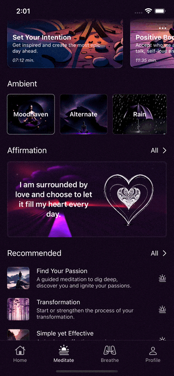

# MOODHAVEN 
**This app is my current project that I'm planing on publishing to the AppStore**

*Only showcasing the visuals, I'll be sharing my app folders on request.*

## Features
- User authentication with modern providers
- Guided Meditations
- Affirmation Cards
- Different Music Playlists
- App Background Ambients
- Customisable Meditations And Scheduling
- Breathe Models and Info's
- Breathe Action Views w/ Haptic Feedback Patterns and Sounds
- Customisable Breathe Patterns for User's Desires
- Support for HealthKit and Apple Watches
- Modern Animations and Beautiful UI Design
- Completely Native SwiftUI Structure

*Feel free to contact me for your questions.*

## Some Visuals

      

 

      

 

       

 
